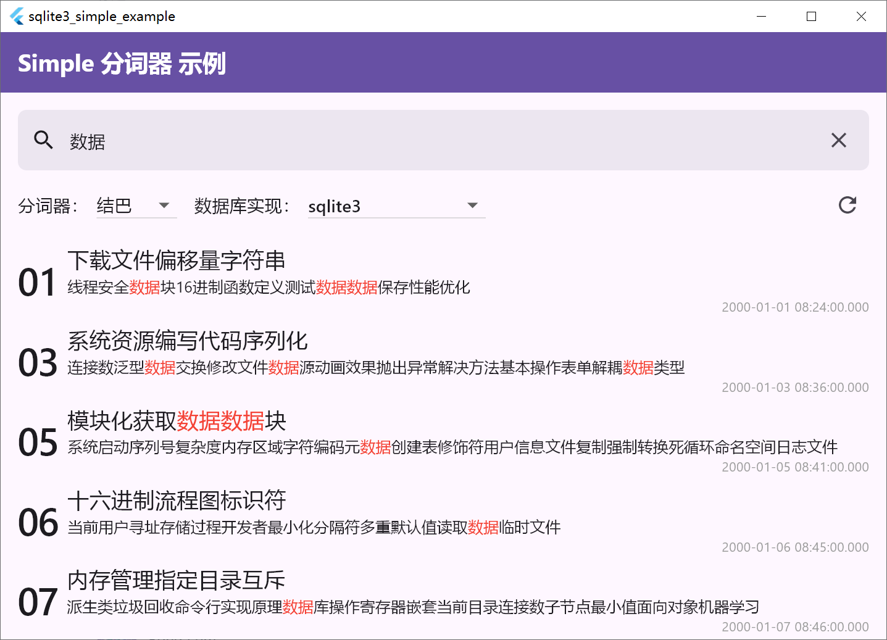
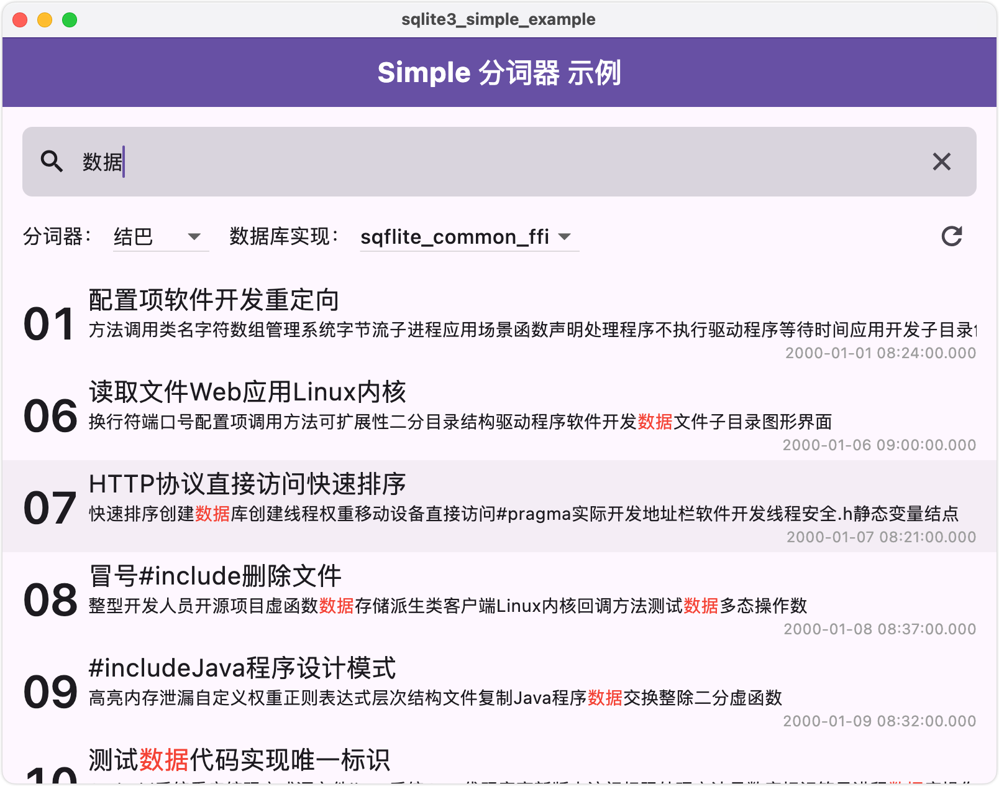

# sqlite3_simple

[](https://pub.dev/packages/sqlite3_simple)
[](https://github.com/SageMik/sqlite3_simple/tree/simple-native)


基于 [Simple](https://github.com/wangfenjin/simple) (支持中文和拼音的 SQLite fts5 全文搜索扩展) 和 [sqlite3.dart](https://github.com/simolus3/sqlite3.dart) 的 Flutter 库，用于 SQLite 中文和拼音全文搜索。

> [!IMPORTANT]
>
> 由于 [sqlite3-ohos.dart 在 HarmonyOS NEXT 上在提交审核后打出正式签名 Release 包崩溃的问题](https://github.com/SageMik/sqlite3-ohos.dart/issues/1)，暂时删除鸿蒙适配，请不要在 HarmonyOS NEXT 平台上继续使用。

| 支持平台                                                                                                        | 示例                          |
|-------------------------------------------------------------------------------------------------------------|-----------------------------|
| **Android ([example.apk](https://github.com/SageMik/sqlite3_simple/releases/download/v1.0.5/example.apk))** |  |
| **iOS**                                                                                                     |          |
| **Windows**                                                                                                 |  |
| **MacOS**                                                                                                   |      |
| **Linux**                                                                                                   |      |

## 目录

- [前置准备](#前置准备)
- [快速开始](#快速开始)
  - [1. 添加 SQLite 依赖](#1-添加-sqlite-依赖)
  - [2. 添加本库并导入依赖](#2-添加本库并导入依赖)
  - [3. 加载 Simple 扩展](#3-加载-simple-扩展)
  - [4. 打开数据库](#4-打开数据库)
  - [5. 查询](#5-查询)
- [待办](#待办)
- [致谢](#致谢)
- [相关项目](#相关项目)

## 前置准备

SQLite 通过 [SQLite FTS5 Extension](https://sqlite.org/fts5.html) 提供 全文搜索 (Full-Text Search) 功能；

Dart 提供 FFI 以调用 SQLite、Simple 等 C/C++ 库；

本库通过 [Simple](https://github.com/wangfenjin/simple) 实现 中文拼音全文搜索，通过 [sqlite3](https://github.com/simolus3/sqlite3.dart/tree/main/sqlite3) 操作数据库和加载自定义扩展。

请参阅相关文档，或 [`example`](./example) 的具体示例，以构建和操作数据库。

> [!TIP]
>
> 本库主要通过 Github Actions 编译和维护 Simple 原生库，以支持本库在不同平台的 Flutter 实现，具体请参阅 [simple-native 分支](https://github.com/SageMik/sqlite3_simple/tree/simple-native) 。
>
> 有关本库的最新开发进展，可以参阅 [develop 分支](https://github.com/SageMik/sqlite3_simple/tree/develop) 。

> [!TIP]
>
> 本库通过 [sqlite3](https://github.com/simolus3/sqlite3.dart/tree/main/sqlite3) 管理数据库，因此理论上任何依赖于 [sqlite3](https://github.com/simolus3/sqlite3.dart/tree/main/sqlite3) 的 Flutter 库均可通过本库实现中文和拼音全文搜索，例如 [drift](https://github.com/simolus3/drift)、[sqflite_common_ffi](https://github.com/tekartik/sqflite/tree/master/sqflite_common_ffi) 等，可以在 [`./example/lib/data/impl`](./example/lib/data/impl) 查看不同实现。

## 快速开始

### 1. 添加 SQLite 依赖

执行如下命令行：

```shell
flutter pub add sqlite3 sqlite3_flutter_libs
```

其中 `sqlite3` 包含了 SQLite 的 Dart FFI 绑定， `sqlite3_flutter_libs` 包含了 SQLite 的原生库 (Native Library) ，源码均在 [sqlite3.dart](https://github.com/simolus3/sqlite3.dart) 。

> [!TIP]
>  
> 若希望自行编译 SQLite 原生库，或环境已存在 SQLite 原生库，可不引入 `sqlite3_flutter_libs` ，自行通过 `DynamicLibrary`、`open.overrideFor` 加载和覆盖。可从下述位置获取相关信息：
> 1. [sqlite.dart](https://github.com/simolus3/sqlite3.dart) 中 [Manually providing sqlite3 libraries](https://github.com/simolus3/sqlite3.dart/tree/main/sqlite3#manually-providing-sqlite3-libraries) 。
> 2. [sqlite-ohos.dart](https://github.com/SageMik/sqlite3-ohos.dart) 中 [自行提供 SQLite 原生库](https://github.com/SageMik/sqlite3-ohos.dart/tree/main/sqlite3#%E8%87%AA%E8%A1%8C%E6%8F%90%E4%BE%9B-sqlite-%E5%8E%9F%E7%94%9F%E5%BA%93) 。
> 3. [`example`](example) 中带有 **Android SQLite 覆盖** 标识的简单示例（可以全局搜索该标识）。

### 2. 添加本库并导入依赖

```shell
flutter pub add sqlite3_simple
```

```dart
import 'package:sqlite3/sqlite3.dart';
import 'package:sqlite3_simple/sqlite3_simple.dart';
```

### 3. 加载 Simple 扩展

```dart
sqlite3.loadSimpleExtension();
```

如需启用 结巴分词 (Jieba) ，请调用 `sqlite3.saveJiebaDict()` 将字典保存到可访问的路径，例如：

```dart
import 'package:path_provider/path_provider.dart';

final docDir = await getApplicationDocumentsDirectory();
final jiebaDictPath = join(docDir.path, "cpp_jieba");

final jiebaDictSql = await sqlite3.saveJiebaDict(jiebaDictPath);
```

返回值 `jiebaDictSql` 是 `"SELECT jieba_dict('$jiebaDictPath')"` 。

### 4. 打开数据库

参阅 [sqlite3](https://github.com/simolus3/sqlite3.dart/tree/main/sqlite3) 相关说明，通过 `sqlite3.open()` 或 `sqlite3.openInMemory()` 打开数据库。

```dart
final db = sqlite3.open('$filename');
```

如需启用结巴分词，请让数据库执行上一步的 `jiebaDictSql` 语句，以修改 Simple 扩展读取结巴分词字典的路径：

```dart
db.execute(jiebaDictSql);
```

推荐在正式查询前执行一次查询，提前加载，例如：

```dart
db.select("SELECT jieba_query('Jieba分词初始化（提前加载避免后续等待）')");
```

### 5. 查询

请参阅 [SQLite FTS5 Extension](https://sqlite.org/fts5.html) 和 [Simple](https://github.com/wangfenjin/simple) 的说明，根据需要调用相应函数如 `jieba_query`、`simple_query`、`highlight`、  `simple_highlight` 等，执行所需的查询，例如 (  [`./example/lib/data/impl/sqlite3_impl.dart`](./example/lib/data/impl/sqlite3_impl.dart) )：

```dart
/// 通过指定分词器 [tokenizer] 搜索， [tokenizer] 取值：jieba, simple
List<MainTableRow> search(String value, String tokenizer) {
  const wrapperSql = "'${ZeroWidth.start}', '${ZeroWidth.end}'";
  final resultSet = db.select('''
      SELECT 
        rowid AS $id, 
        simple_highlight($fts5Table, 0, $wrapperSql) AS $title, 
        simple_highlight($fts5Table, 1, $wrapperSql) AS $content, 
        $insertDate 
      FROM $fts5Table 
      WHERE $fts5Table MATCH ${tokenizer}_query(?);
    ''', [value]);
  return _toMainTableRows(resultSet);
}
```

## 待办

- [X] 添加其他平台的适配。
  - [X] Windows
  - [X] MacOS
  - [X] Linux
  - [ ] HarmonyOS NEXT
- [ ] 添加用户自定义字典。

## 致谢

[Simple](https://github.com/wangfenjin/simple)：支持中文和拼音的 SQLite FTS5 全文搜索扩展。

[sqlite3.dart](https://github.com/simolus3/sqlite3.dart)：SQLite3 的 Dart FFI 绑定。

[extended_text](https://github.com/fluttercandies/extended_text)：Flutter Text 的扩展组件，支持特殊文本效果。

## 相关项目

[sqlite3-simple](https://github.com/SageMik/sqlite3_simple_ohos/tree/main/sqlite3_simple)：基于 [Simple](https://github.com/wangfenjin/simple) (支持中文和拼音的 SQLite fts5 全文搜索扩展) 的 HarmonyOS NEXT 库，用于 [@ohos.data.relationalStore (关系型数据库)](https://developer.huawei.com/consumer/cn/doc/harmonyos-references-V5/js-apis-data-relationalstore-V5?catalogVersion=V5) 的中文和拼音全文搜索。