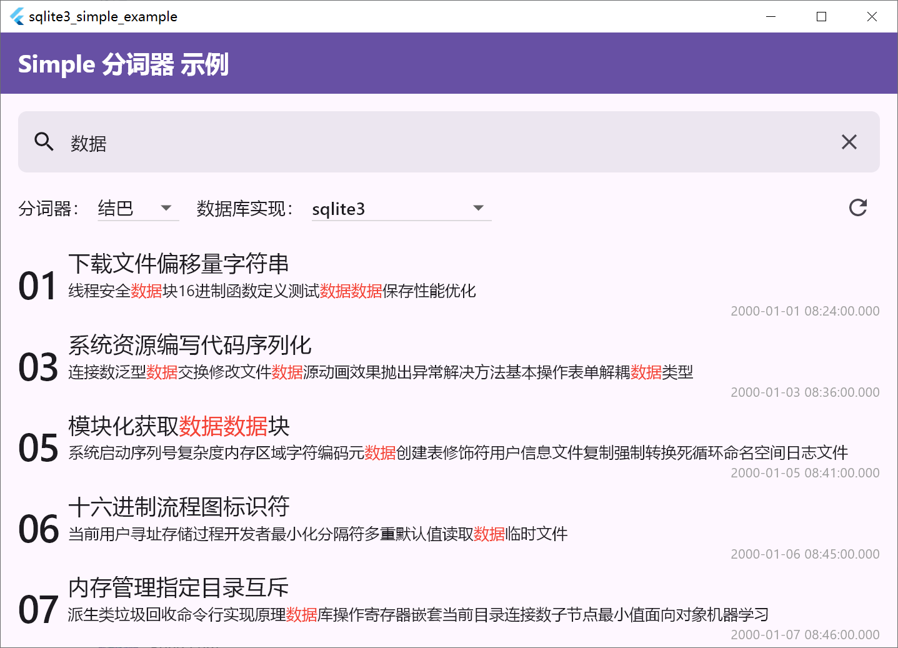
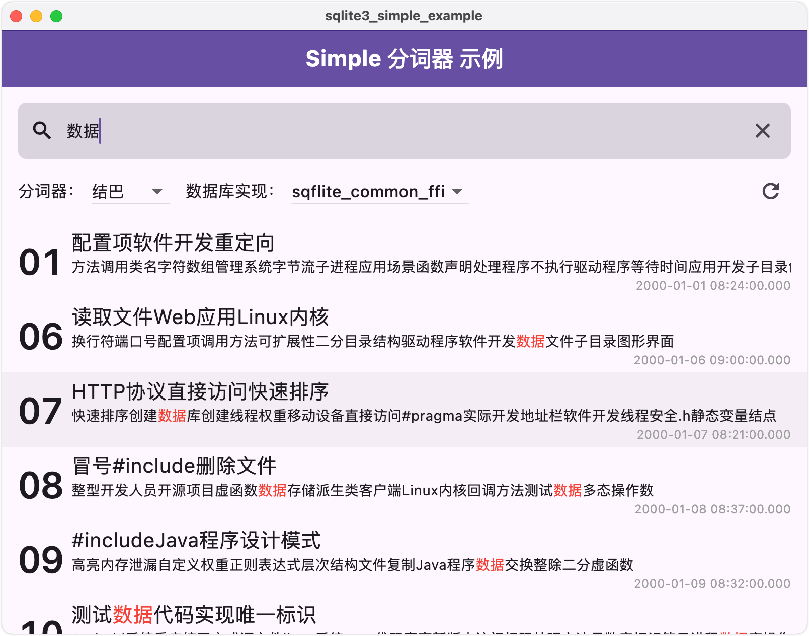
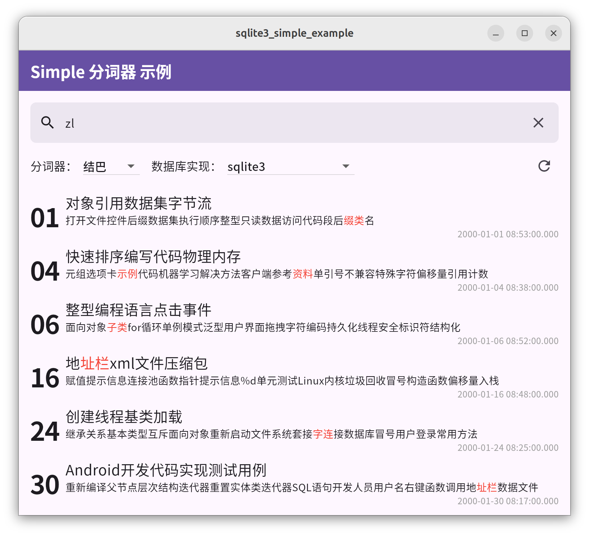

# sqlite3_simple

[](https://pub.dev/packages/sqlite3_simple) [](https://github.com/SageMik/sqlite3_simple/tree/simple-native)

     

基于 [Simple](https://github.com/wangfenjin/simple) (支持中文和拼音的 SQLite FTS5 全文搜索扩展) 和 [sqlite3.dart](https://github.com/simolus3/sqlite3.dart) 的 Flutter 库，用于 SQLite 中文和拼音全文搜索。

> [!NOTE]
>
> 本库现已支持 Web 平台，在线演示：[Simple 分词器 示例](https://sagemik.github.io/sqlite3_simple) 。
> 
> Web 平台使用步骤与其他平台存在差异，请参阅 [`doc/web.md`](doc/web.md)。

> [!TIP]
>
> `sqlite3` 在 [`3.0.0`](https://github.com/simolus3/sqlite3.dart/releases/tag/sqlite3-3.0.0) 即 v3 版本引入了 [Dart Hooks](https://dart.dev/tools/hooks) 管理 SQLite 原生库（Native Library），与 v2 版本不再兼容。本库基于 v3 版本，v2 请查看 [`v1` 分支](https://github.com/SageMik/sqlite3_simple/tree/v1)，使用 `sqlite3_simple: ^2.0.0` 以下的版本。

| 支持平台                                                                                                        | 示例                              |
|-------------------------------------------------------------------------------------------------------------|---------------------------------|
| **Android ([example.apk](https://github.com/SageMik/sqlite3_simple/releases/download/v2.0.0/example.apk))** |  |
| **iOS**                                                                                                     |          |
| **Windows**                                                                                                 |  |
| **MacOS**                                                                                                   |      |
| **Linux**                                                                                                   |      |
| **Web**                                                                                                     |          |

## 目录

- [前置准备](#前置准备)
- [快速开始](#快速开始)
  - [1. 添加 `sqlite3` 依赖](#1-添加-sqlite3-依赖)
  - [2. 添加本库并导入依赖](#2-添加本库并导入依赖)
  - [3. 加载 Simple 扩展](#3-加载-simple-扩展)
  - [4. 打开数据库](#4-打开数据库)
  - [5. 创建主表、FTS5 虚表和触发器](#5-创建主表fts5-虚表和触发器)
  - [6. 查询](#6-查询)
- [致谢](#致谢)

## 前置准备

SQLite 通过 [SQLite FTS5 Extension](https://sqlite.org/fts5.html) 提供全文搜索 (Full-Text Search) 功能；

Dart 提供 FFI 以调用 SQLite、Simple 等 C/C++ 库；

本库通过 [Simple](https://github.com/wangfenjin/simple) 实现中文和拼音全文搜索，通过 [`sqlite3`](https://github.com/simolus3/sqlite3.dart/tree/main/sqlite3) 操作数据库和加载自定义扩展。

请参阅相关文档，或 [`example`](example) 的具体示例，以构建和操作数据库。

> [!TIP]
>
> 本库通过 Github Actions 维护 Simple 原生库以提供不同平台的实现，具体请参阅 [`simple-native` 分支](https://github.com/SageMik/sqlite3_simple/tree/simple-native) 。
>
> 本库通过 [`sqlite3`](https://github.com/simolus3/sqlite3.dart/tree/main/sqlite3) 管理数据库，因此理论上任何依赖于 `sqlite3` 的 Flutter 库，均可通过本库实现中文和拼音全文搜索，例如 [`drift`](https://github.com/simolus3/drift)、[`sqflite_common_ffi`](https://github.com/tekartik/sqflite/tree/master/sqflite_common_ffi)，可在 [`example/lib/data/impl`](example/lib/data/impl) 查看具体示例。

## 快速开始

### 1. 添加 `sqlite3` 依赖

执行如下命令行：

```shell
flutter pub add sqlite3
```

 `sqlite3` 包含了 SQLite 原生库的 Dart FFI 绑定，以及通过 [Dart Hooks](https://dart.dev/tools/hooks) 管理原生库的流程。如需自定义 SQLite 原生库，可参考[其文档说明](https://github.com/simolus3/sqlite3.dart/blob/main/sqlite3/doc/hook.md)进行配置。

### 2. 添加本库并导入依赖

```shell
flutter pub add sqlite3_simple
```

```dart
import 'package:sqlite3/sqlite3.dart';
import 'package:sqlite3_simple/sqlite3_simple.dart';
```

### 3. 加载 Simple 扩展

```dart
sqlite3.loadSimpleExtension();
```

如需启用 结巴分词 (Jieba) ，请调用 `sqlite3.saveJiebaDict()` 将字典保存到可访问的路径，例如：

```dart
import 'package:path_provider/path_provider.dart';

final docDir = await getApplicationDocumentsDirectory();
final jiebaDictPath = join(docDir.path, "cpp_jieba");

final jiebaDictSql = await sqlite3.saveJiebaDict(jiebaDictPath);
```

返回值 `jiebaDictSql` 是 `"SELECT jieba_dict('$jiebaDictPath')"` 。

### 4. 打开数据库

参阅 [`sqlite3`](https://github.com/simolus3/sqlite3.dart/tree/main/sqlite3) 的说明，通过 `sqlite3.open()` 或 `sqlite3.openInMemory()` 打开数据库。

```dart
final db = sqlite3.open('$filename');
```

如需启用结巴分词，请让数据库执行上一步的 `jiebaDictSql` 语句，以修改 Simple 扩展读取结巴分词字典的路径：

```dart
db.execute(jiebaDictSql);
```

推荐在正式查询前执行一次查询，提前加载，例如：

```dart
db.select("SELECT jieba_query('Jieba分词初始化（提前加载避免后续等待）')");
```

上述初始化逻辑可以参考 [`example/lib/data/impl/sqlite3/sqlite3_impl.dart`](./example/lib/data/impl/sqlite3/sqlite3_impl.dart)。

### 5. 创建主表、FTS5 虚表和触发器

根据 [SQLite FTS5 Extension](https://sqlite.org/fts5.html) 的说明和实际项目需求，创建主表、FTS5 虚表和触发器，例如 [`Sqlite3Fts5Creator.createMainAndFts5()`](./example/lib/data/impl/sqlite3/sqlite3_dao.dart)：
  
```dart
const fts5Tokenizer = "simple";
const mainTable = "custom";
const id = "id",
    title = "title",
    content = "content",
    insertDate = "insert_date";
const fts5Table = "t1";

Future<void> createMainAndFts5(CommonDatabase db) async {
  /// 主表
  db.execute('''
    CREATE TABLE $mainTable (
      $id INTEGER PRIMARY KEY AUTOINCREMENT, 
      $title TEXT, 
      $content TEXT, 
      $insertDate INTEGER
    );
  ''');

  /// FTS5虚表
  db.execute('''
    CREATE VIRTUAL TABLE $fts5Table USING fts5(
      $title, $content, $insertDate UNINDEXED, 
      tokenize = '$fts5Tokenizer', 
      content = '$mainTable', 
      content_rowid = '$id'
    );
  ''');

  /// 触发器
  const newInsert = '''
    INSERT INTO $fts5Table(rowid, $title, $content, $insertDate) 
      VALUES (new.$id, new.$title, new.$content, new.$insertDate);
  ''';
  const deleteInsert = '''
    INSERT INTO $fts5Table($fts5Table, rowid, $title, $content, $insertDate) 
      VALUES ('delete', old.$id, old.$title, old.$content, old.$insertDate);
  ''';
  db.execute('''
    CREATE TRIGGER ${mainTable}_insert AFTER INSERT ON $mainTable BEGIN 
      $newInsert
    END;
  ''');
  db.execute('''
    CREATE TRIGGER ${mainTable}_delete AFTER DELETE ON $mainTable BEGIN 
      $deleteInsert
    END;
  ''');
  db.execute('''
    CREATE TRIGGER ${mainTable}_update AFTER UPDATE ON $mainTable BEGIN 
      $deleteInsert
      $newInsert
    END;
  ''');
}
```

### 6. 查询

参阅 [Simple](https://github.com/wangfenjin/simple) 的说明，根据需要调用 `jieba_query`、`simple_query`、`highlight`、`simple_highlight` 进行查询，例如 [`Sqlite3Dao.search()`](./example/lib/data/impl/sqlite3/sqlite3_dao.dart)：


```dart
/// 通过指定分词器 [tokenizer] 搜索， [tokenizer] 取值：jieba, simple
List<MainTableRow> search(String value, String tokenizer) {
  const wrapperSql = "'${ZeroWidth.start}', '${ZeroWidth.end}'";
  final resultSet = db.select('''
      SELECT 
        rowid AS $id, 
        simple_highlight($fts5Table, 0, $wrapperSql) AS $title, 
        simple_highlight($fts5Table, 1, $wrapperSql) AS $content, 
        $insertDate 
      FROM $fts5Table 
      WHERE $fts5Table MATCH ${tokenizer}_query(?);
    ''', [value]);
  return _toMainTableRows(resultSet);
}
```

## 致谢

[Simple](https://github.com/wangfenjin/simple)：支持中文和拼音的 SQLite FTS5 全文搜索扩展。

[sqlite3.dart](https://github.com/simolus3/sqlite3.dart)：SQLite3 的 Dart FFI 绑定。

[extended_text](https://github.com/fluttercandies/extended_text)：Flutter Text 的扩展组件，支持特殊文本效果。

[wasd](https://github.com/medz/wasd)：面向 Dart 和 Flutter 生态系统的纯 Dart WebAssembly 运行时。

[Riverpod](https://github.com/rrousselGit/riverpod)：响应式缓存与数据绑定框架，用于应用的状态管理。

[Squadron](https://github.com/d-markey/squadron)：Dart 多线程管理框架。